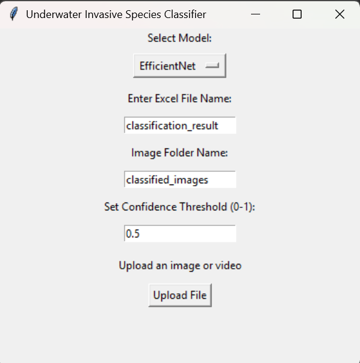

# aquatic_ai

This project provides a graphical interface for classifying aquatic plants (including invasive species) using pre-trained deep learning models. It allows users to upload images or videos, select a model, configure thresholds, and save the classification results in an Excel file with hyperlinks to the processed images.

## 📌 Features

- ✅ Support for image and video file classification  
- ✅ Selectable deep learning models (`EfficientNet`, `DenseNet121`, `Swin Transformer`, `ViT`)  
- ✅ Save results to Excel with formatted columns and clickable image links  
- ✅ Adjustable confidence threshold  
- ✅ Customizable Excel filename and output folder  

## 🧠 Available Models

- `EfficientNet`
- `DenseNet121`
- `Swin Transformer` (.pth too large for GitHub)
- `ImageNet ViT (Vision Transformer)` (.pth too large for GitHub)

All models are trained on 12 aquatic plant species:

- **bladderwort**
- **canadian_waterweed**
- **carolina_fanwort** _(invasive)_
- **coontail**
- **curly_leaf_pondweed** _(invasive)_
- **eurasian_watermilfoil** _(invasive)_
- **european_frogbit** _(invasive)_
- **hydrilla** _(invasive)_
- **parrotfeather** _(invasive)_
- **richards_pondweed**
- **siberian_watermilfoil**
- **starry_stonewort** _(invasive)_

## 🖼️ Screenshot



## 🛠 Requirements

- Python 3.8+
- `torch`
- `torchvision`
- `opencv-python`
- `Pillow`
- `pandas`
- `openpyxl`
- `timm`
- `tkinter`

Install dependencies using pip:

```bash
pip install torch torchvision opencv-python pillow pandas openpyxl timm
```

## 🚀 Getting Started

1. Clone the repo or download the script:

```bash
git clone https://github.com/JoshuaCooling/aquatic_ai.git
cd aquatic_ai
```

2. Place your model files in the same directory:

```
- efficientnet_aquatic_plants.pth
- invasive_species_model.pth
- swin_tiny(74).pth
- vision_transformer_model_copy.pth
```

3. Run the app:

```bash
python ui.py
```

## 📂 Output

- A folder (default: `classified_images`) will be created to store classified video frames.
- An Excel file (default: `classification_results.xlsx`) will be generated or updated with:
  - **Time** — Timestamp in HH:MM:SS for video frames.
  - **Predicted Class** — Class label.
  - **Confidence** — Prediction confidence.
  - **Image Path** — Hyperlinked path to saved image (clickable in Excel).

## ⚙️ Customization

### Change model
Use the dropdown to switch between different model architectures.

### Set confidence threshold
Use the confidence input to define the minimum confidence score for logging predictions (e.g., 0.75).

### Set Excel file name
You can enter a custom Excel filename (e.g., `results_april15`) which will be saved as `results_april15.xlsx`.
Ensure that this is an Excel filename that does not exist

### Set output folder
Specify a different folder name to save processed video frames.
Ensure that this is a folder name that does not exist

## 🎥 Supported Formats

- Images: `.jpg`, `.jpeg`, `.png`
- Videos: `.mp4`

## 🔍 How It Works

- Images are resized to 224x224 and passed through the selected model.
- For videos, every Nth frame (default 1 second interval) is classified.
- Invasive species are only logged if their prediction confidence is above the set threshold.
- Results are stored with a timestamp and hyperlink to the saved image.

## 🧪 Example Workflow

1. Start the app.
2. Select a model (e.g., EfficientNet).
3. Set a custom Excel filename and confidence threshold.
4. Upload an image or video.
5. Watch the video frames being processed and results saved.
6. Open the Excel file to review classifications.

## 🛡️ Notes

- All processing is done on the CPU by default.


One of the classification models used by this application was trained using `dnet.py`, located in the root directory.

- **Architecture**: DenseNet-121 (pretrained on ImageNet)
- **Training Script**: dnet.py
- **Dataset**: ImageFolder directory of labeled aquatic plant species (including invasive species)
- **Input Size**: 224x224
- **Classes**: Automatically inferred from folder structure
- **Training Epochs**: 5
- **Optimizer**: Adam, LR=0.001
- **Loss Function**: CrossEntropyLoss

The resulting model is saved as `invasive_species_model.pth` and must be loaded by the UI backend for predictions.


